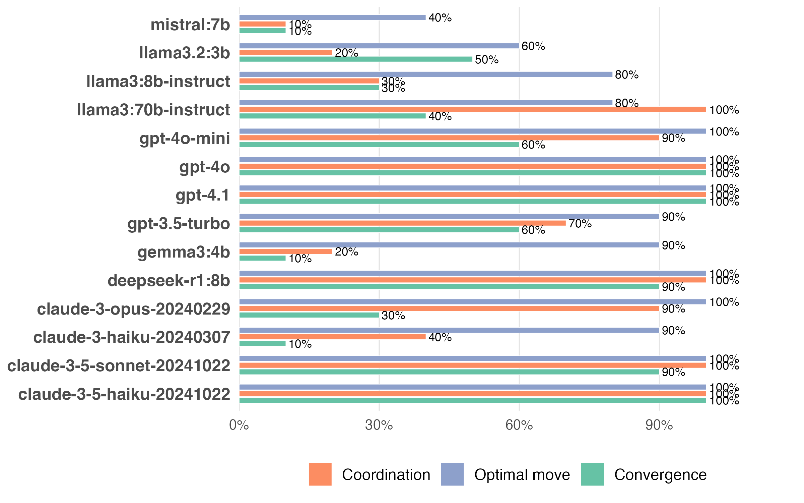

# AI-norms-prompting

## Model Performance Analysis

The following plot shows the performance of different models across three key questions: analogy understanding, optimal move identification, and convergence prediction.

